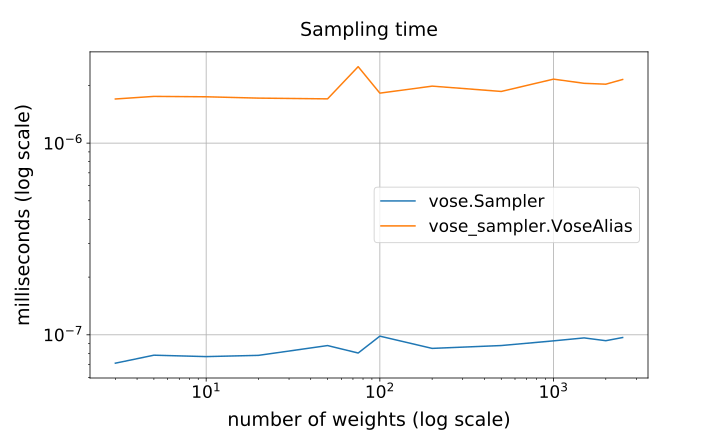
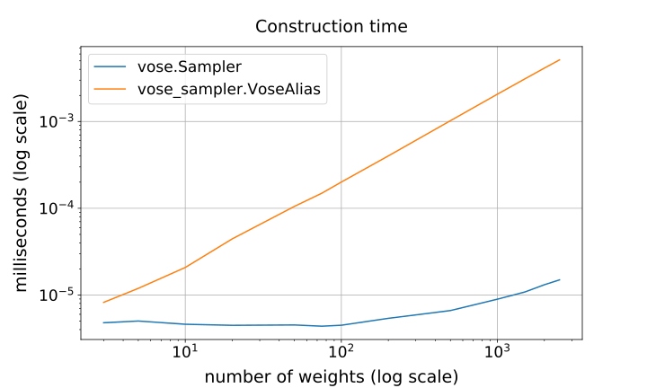

# vose

This is a Cython implemention of Michael Vose's [Alias method](https://www.wikiwand.com/en/Alias_method). It can be used to perform weighted sampling with replacement of integers in `O(1)` time. It requires a construction phase that runs in `O(n)` time, with `n` being the number of integers with associated weights. As far as I know, it's faster than any other method available in Python. But I would love to be proven wrong!

I wrote this because I had a specific usecase where I needed to repeatidly sample integers with a weight associated to each integer. I stumbled on Keith Schwarz's [*Darts, Dice, and Coins: Sampling from a Discrete Distribution*](https://www.keithschwarz.com/darts-dice-coins/), which is very well written, and decided to use the Alias method. Alas, `numpy` doesn't seem to have it available, and neither does the `random` module from Python's standard library. There is, however, the [`vose_sampler`](https://github.com/asmith26/Vose-Alias-Method) package, but it is written in pure Python and isn't fast enough for my purposes. I therefore decided to write it in Cython and shamelessly adapted Keith Schmarz's [Java implementation](https://www.keithschwarz.com/interesting/code/?dir=alias-method).

## Installation

My feeling is that this package is too small to justify putting it on PyPI. Therefore, you have to install it from GitHub. If ever the scope grows larger I might reconsider this.

```sh
pip install git+https://github.com/MaxHalford/vose
```

This will install `cython` as well as `numpy` if you do not already have them installed.

## Usage

You first have to initialize a sampler with an array of weights. These weights are not required to sum up to 1.

```py
>>> import numpy as np
>>> import vose

>>> weights = np.array([.1, .3, .4, .2])
>>> sampler = vose.Sampler(weights, seed=42)

```

You can then call the `.sample()` method to sample a random integer in range `[0, n - 1]`, where `n` is the number of weights that were passed.

```py
>>> sampler.sample()
2

```

You can set the `k` parameter in order to produce multiple samples.

```py
>>> sampler.sample(k=10)
array([1, 1, 2, 1, 2, 1, 0, 1, 3, 3])

```

By default, a copy of the weights is made. You can disable this behavior in order to save a few microseconds, but this will modify the provided array.

```py
>>> sampler = vose.Sampler(weights, seed=42, copy=False)

```

Note that `vose.Sampler` expects to be provided with a [memoryview](https://docs.python.org/3/c-api/memoryview.html). In order to pass a list, you have to convert it yourself to a numpy array.

```py
>>> weights = [.2, .3, .5]
>>> sampler = vose.Sampler(np.array(weights))

```

You can also use `vose.Sampler` from within your own Cython `.pyx` file:

```py
import numpy as np

cimport vose
cimport numpy as np

cdef np.float_t [:] weights = np.array([.2, .3, .5], dtype=np.float)
cdef vose.sampler.Sampler sampler
sampler = vose.sampler.Sampler(weights)

cdef int sample = sampler.sample_1()
cdef np.int_t [:] samples = sampler.sample_k(10)
```

Also, this will require import the `numpy` headers in the extension definition in your `setup.py`:

```py
from setuptools import Extension
from setuptools import setup
from Cython.Build import cythonize
import numpy as np

extension = Extension(
    '*', ['your_file.pyx'],
    include_dirs=[np.get_include()],
    define_macros=[('NPY_NO_DEPRECATED_API', 'NPY_1_7_API_VERSION')]
)

setup(ext_modules=cythonize([extension]))
```

## Is it reliable?

It seems to be working correctly; at least according to the following [chi-squared tests](https://www.wikiwand.com/en/Chi-squared_test):

```py
>>> import numpy as np
>>> from scipy import stats

>>> rng = np.random.RandomState(42)
>>> k = 1000

>>> for n in range(3, 20):
...     weights = rng.dirichlet(np.arange(1, n))
...     sampler = vose.Sampler(weights, seed=42)
...     samples = sampler.sample(k)
...     chi2 = stats.chisquare(f_obs=np.bincount(samples), f_exp=weights * k)
...     assert chi2.pvalue > .05

```

## Is it fast?

Hell yeah. The following graph shows the average time taken to sample one integer for different amounts of weights:

<div align="center">
    
</div>

As you can see, `vose.Sampler` takes less than a nanosecond to produce a random integer. Here is the construction time:

<div align="center">
    
</div>

`vose.Sampler` is also fast enough to compete with `numpy` and `random`, even when including the construction time. The following table summarizes a comparison I made on my laptop, with `n` being the number of weights and `k` the number of integers to sample:

|    n |    k | np.random.choice   | random.choices   | vose.Sampler   | vose_sampler.VoseAlias   |
|-----:|-----:|:-------------------|:-----------------|:---------------|:-------------------------|
|    3 |    1 | 26ns               | 2ns              | 4ns            | 11ns                     |
|    3 |    2 | 26ns               | 3ns              | 7ns            | 13ns                     |
|    3 |    3 | 26ns               | 3ns              | 7ns            | 14ns                     |
|    3 |   10 | 26ns               | 6ns              | 7ns            | 27ns                     |
|    3 |  100 | 28ns               | 47ns             | 8ns            | 198ns                    |
|    3 | 1000 | 46ns               | 461ns            | 19ns           | 1μs, 887ns               |
|   30 |    1 | 27ns               | 6ns              | 4ns            | 69ns                     |
|   30 |    2 | 26ns               | 7ns              | 7ns            | 73ns                     |
|   30 |    3 | 27ns               | 7ns              | 8ns            | 72ns                     |
|   30 |   10 | 27ns               | 14ns             | 7ns            | 88ns                     |
|   30 |  100 | 31ns               | 63ns             | 8ns            | 256ns                    |
|   30 | 1000 | 67ns               | 580ns            | 19ns           | 1μs, 935ns               |
|  300 |    1 | 29ns               | 47ns             | 6ns            | 661ns                    |
|  300 |    2 | 29ns               | 47ns             | 9ns            | 659ns                    |
|  300 |    3 | 29ns               | 49ns             | 9ns            | 685ns                    |
|  300 |   10 | 29ns               | 54ns             | 9ns            | 685ns                    |
|  300 |  100 | 36ns               | 112ns            | 10ns           | 877ns                    |
|  300 | 1000 | 96ns               | 717ns            | 20ns           | 2μs, 599ns               |
| 3000 |    1 | 52ns               | 416ns            | 18ns           | 6μs, 988ns               |
| 3000 |    2 | 50ns               | 420ns            | 21ns           | 7μs, 39ns                |
| 3000 |    3 | 51ns               | 439ns            | 21ns           | 7μs, 102ns               |
| 3000 |   10 | 51ns               | 420ns            | 21ns           | 7μs, 332ns               |
| 3000 |  100 | 59ns               | 496ns            | 23ns           | 7μs, 349ns               |
| 3000 | 1000 | 137ns              | 1μs, 213ns       | 35ns           | 10μs, 190ns              |


In summary, you probably don't need to be using `vose.Sampler` if you only need to sample once, regardless of the number of integers you wish to sample. You want to use `vose.Sampler` when you need to sample in a sequential manner, because at that point the construction time will be amortized. Indeed, this will bring you two orders of magnitude improved speed, when compared to calling `np.random.choice` or `random.choices` multiple times.

## Further work

- The weights assigned to each integer cannot be modified. A [search tree](https://www.wikiwand.com/en/Search_tree) can be used as a data structure that supports modifications. This allows modifying weights in `O(log(n))` time, but means sampling also happens in `O(log(n))` time. More information [here](https://stackoverflow.com/questions/34247459/an-efficient-version-alternative-to-the-alias-method-that-samples-without-replac).
- I'm not 100% the memory allocation of the memoryviews is optimal.
- Initializing a `vose.Sampler` from another Cython `.pyx` file seems to require some Python interaction; there's probably a way to avoid this.
